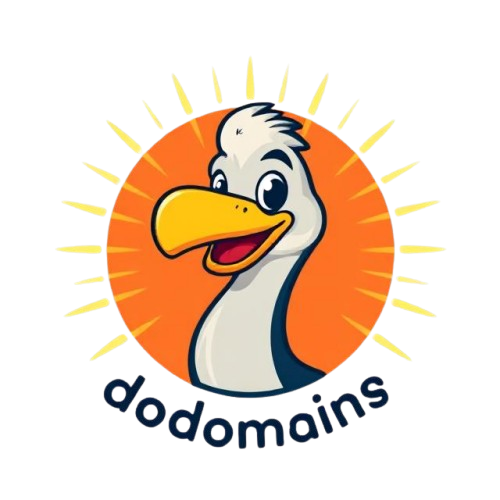

# dodomains.dev 🦤

The first 100% free domain name generator to use advanced LLMs for highly creative, available domain suggestions.



## ✨ Features

- **100% Free to Use** - No hidden costs or premium features
- **AI-Powered Suggestions** - Using advanced LLMs for creative domain names
- **Available Domains Only** - Verified against existing domain records
- **Highly Creative Suggestions** - Beyond traditional domain generators

## 🚀 Getting Started

### Prerequisites

- Node.js 18.x or later
- npm, yarn, pnpm, or bun

### Installation

1. Clone the repository:

```bash
git clone https://github.com/r13i/dodomains.git
cd dodomains
```

2. Install dependencies:

```bash
npm install
# or
yarn install
# or
pnpm install
# or
bun install
```

3. Run the development server:

```bash
npm run dev
# or
yarn dev
# or
pnpm dev
# or
bun dev
```

4. Open [http://localhost:3000](http://localhost:3000) with your browser to see the result.

## 🛠️ How It Works

1. **Enter Your Keywords** - Provide keywords and a brief description of your project
2. **LLM-Powered Generation** - Our LLM technology creates uniquely creative and brandable domain suggestions
3. **Availability Check** - We verify domain availability in real-time so you only see domains you can register

## 🧩 Tech Stack

- [Next.js](https://nextjs.org) - React framework
- [Tailwind CSS](https://tailwindcss.com) - Utility-first CSS framework
- [shadcn/ui](https://ui.shadcn.com) - Re-usable components
- [Geist Font](https://vercel.com/font) - Optimized font family

## 📝 License

This project is open source and available under the [MIT License](LICENSE).

## 👨‍💻 Built with ❤️ by [redouane](https://x.com/redouaneoachour)

---

© dodomains.dev. The first 100% free LLM-powered domain name generator.
